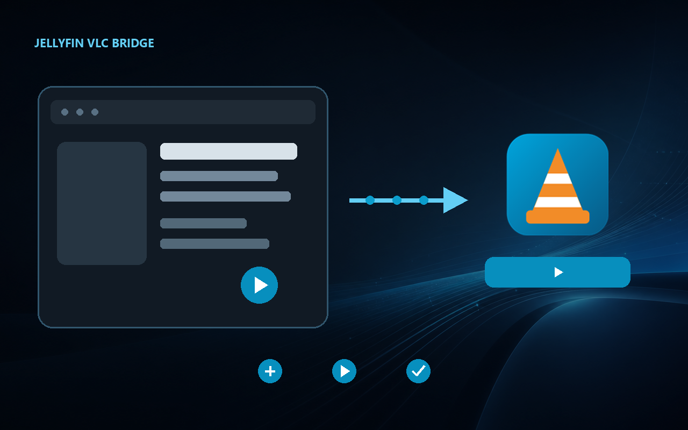

  

<h1 align="center">Jellyfin VLC Bridge</h1>

  Play Jellyfin movies, shows and collections in VLC with resume support and synchronized progress.

  
  
  

  <a href="https://github.com/CrySer66/jellyfin-vlc-bridge/releases/latest"><strong>Download for Windows</strong></a>
  ·
  <a href="https://chromewebstore.google.com/detail/hkjbodgdbjhignhlbecchiigcfigpidp"><strong>Install the Chrome extension</strong></a>
  ·
  <a href="INSTALLATION.en.md">Installation guide</a>
  ·
  <a href="README.md">Français</a>

Jellyfin VLC Bridge adds a **Play with VLC** action to Jellyfin Web. It opens the original media in VLC on the Windows PC without modifying the Jellyfin server or sending data to the developer.

| Application | Platform | Extension |
|---|---|---|
| **1.13.0** | **Windows 10/11 x64** | **Chrome Web Store 1.7.0** |

  

## Installation

1. Install [VLC Media Player](https://www.videolan.org/vlc/).
2. Download `JellyfinVlcBridge-<version>-Setup.exe` from the [latest GitHub release](https://github.com/CrySer66/jellyfin-vlc-bridge/releases/latest).
3. Run the installer and enter your Jellyfin server address.
4. Approve the code in **Jellyfin → Settings → Quick Connect**.
5. Install the [official Chrome extension](https://chromewebstore.google.com/detail/hkjbodgdbjhignhlbecchiigcfigpidp).
6. Reload Jellyfin, open a media item and select **Play with VLC**.

Installation is per Windows user and does not require administrator rights. The [detailed guide](INSTALLATION.en.md) also covers HTTP Direct Play, SMB, updates and uninstallation.

## Features

- movies, episodes, seasons, shows and collections;
- resume from the saved position or restart from the beginning;
- playback, pause, stop and progress synchronization with Jellyfin;
- automatic continuation through prepared episodes or movies;
- recommended HTTP Direct Play or an existing SMB share;
- Quick Connect authentication without copying an administrator API key;
- Jellyfin token protection through Windows Credential Manager;
- graphical diagnostics and repair in the Control Center;
- guided updates from GitHub Releases;
- silent background launch without a command window or Jellyfin file changes.

## Privacy and security

The project contains no advertising, telemetry or analytics. The extension sends only the media identifier and playback choices to the companion application on the same PC. The local relay listens exclusively on `127.0.0.1`.

Diagnostics and support packages generated by the application exclude the Jellyfin token and personal identifiers. See the [privacy policy](PRIVACY.md), [security policy](SECURITY.md) and [code-signing policy](CODE_SIGNING.md).

The application to SignPath Foundation’s free open-source code-signing program has been submitted and is awaiting review. Downloads are therefore still unsigned and Windows SmartScreen may display a warning.

## Languages

The Windows application and Chrome extension support French and English. Chrome automatically follows the browser language. The Control Center follows Windows and also offers a manual language choice.

## Documentation and contributing

- [Detailed installation](INSTALLATION.en.md)
- [Building and development](docs/DEVELOPMENT.md)
- [Contributing](CONTRIBUTING.md)
- [Release history](CHANGELOG.md)
- [Report a problem](https://github.com/CrySer66/jellyfin-vlc-bridge/issues/new/choose)

The application, extension, installer and test sources are public. Compiled executables are published separately in [GitHub Releases](https://github.com/CrySer66/jellyfin-vlc-bridge/releases).

## Current limitations

- the finished installer targets Windows 10/11 x64;
- VLC must be installed separately;
- audio and subtitle tracks are selected in VLC;
- a major Jellyfin Web change may require an extension update.

## License

Jellyfin VLC Bridge is an independent project and is not affiliated with Jellyfin, VideoLAN, Google or Microsoft. It is distributed under the [MIT license](LICENSE).
