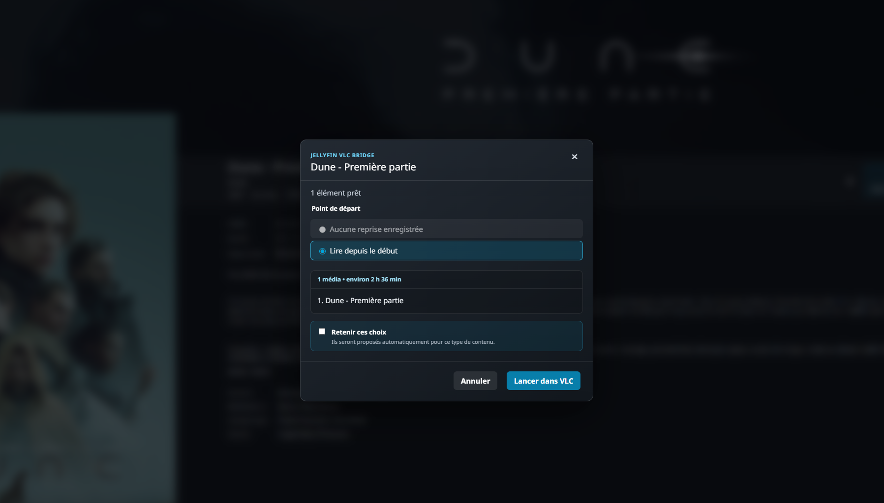

  

<h1 align="center">Jellyfin VLC Bridge</h1>

  Play Jellyfin movies, shows and collections in VLC with resume and synchronized progress.

  
  
  

  <a href="https://github.com/CrySer66/jellyfin-vlc-bridge/releases/latest"><strong>⬇ Download for Windows</strong></a>
  ·
  <a href="https://chromewebstore.google.com/detail/hkjbodgdbjhignhlbecchiigcfigpidp"><strong>Install the Chrome extension</strong></a>
  ·
  <a href="INSTALLATION.en.md">Installation guide</a>
  ·
  <a href="README.md">Français</a>

Jellyfin VLC Bridge adds a **Play with VLC** button to Jellyfin Web. The original media is opened in VLC on the client PC without modifying Jellyfin or sending data to the developer.

| Application | Platform | Extension |
|---|---|---|
| **1.12.0** | **Windows 10/11 x64** | **Chrome Web Store 1.7.0** |

  

## Quick installation

1. Install [VLC](https://www.videolan.org/vlc/).
2. Download `JellyfinVlcBridge-<version>-Setup.exe` from the [latest GitHub Release](https://github.com/CrySer66/jellyfin-vlc-bridge/releases/latest).
3. Run the installer and enter your Jellyfin server address.
4. Approve the Quick Connect code in Jellyfin.
5. Install the official Jellyfin VLC Bridge extension from the Chrome Web Store.
6. Open or reload a Jellyfin media page, then select **Play with VLC**.

The application installs for the current Windows user and does not require administrator rights.

## Languages

The Windows application and Chrome extension support French and English.

- Chrome automatically follows the browser language.
- The Windows Control Center follows the Windows display language by default.
- **Language** in the Control Center can force French or English.
- English is used as the fallback for other languages.

## Playback

HTTP Direct Play is the recommended mode. Jellyfin sends the original file to VLC without video transcoding.

SMB mode lets VLC open an existing Windows network share directly. Use it only when the share already works in File Explorer and configure its path mapping in the Control Center.

The Bridge can resume playback, synchronize progress with Jellyfin, continue with following episodes and prepare movie collections.

## Privacy

The project contains no advertising, analytics or telemetry. The Jellyfin token is protected locally by Windows and is never included in copied diagnostics. See [PRIVACY.md](PRIVACY.md).

## Support

Report a reproducible issue through [GitHub Issues](https://github.com/CrySer66/jellyfin-vlc-bridge/issues/new/choose).

This is an independent project and is not affiliated with Jellyfin, VideoLAN, Google or Microsoft.

See [CONTRIBUTING.md](CONTRIBUTING.md) before proposing a code change. Do not
publish a vulnerability in a public Issue; use the private process described in
[SECURITY.md](SECURITY.md).
